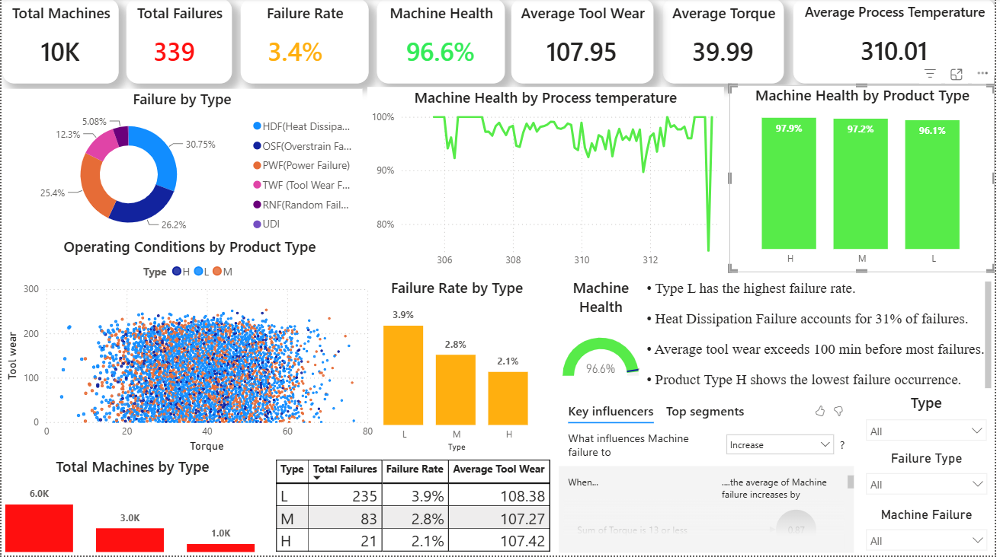

# 🏭 Manufacturing Equipment Health & Quality Analytics Dashboard

An interactive **Power BI dashboard** designed to monitor equipment health, analyze machine failures, and identify operational factors contributing to manufacturing downtime. This project demonstrates how Business Intelligence can support predictive maintenance, improve equipment reliability, and enable data-driven decision-making in industrial environments.

---

## 📸 Dashboard Preview



---

# 📌 Business Problem

Manufacturing companies generate large amounts of machine and sensor data every day. Without proper analysis, identifying failure patterns and planning preventive maintenance becomes difficult, resulting in unexpected downtime and increased operational costs.

This dashboard provides a centralized view of machine health, equipment performance, and failure patterns to support maintenance teams and production managers in making informed decisions.

---

# 🎯 Project Objectives

- Monitor overall machine health
- Analyze machine failure rates
- Identify the most common failure types
- Compare equipment performance across product types
- Support predictive maintenance initiatives
- Improve operational efficiency using data-driven insights

---

# 📊 Key Performance Indicators (KPIs)

- Total Machines Monitored
- Total Machine Failures
- Failure Rate
- Machine Health Score
- Average Tool Wear
- Average Torque
- Average Process Temperature

---

# 📈 Dashboard Features

### Equipment Health Monitoring
- Machine Health Score
- Failure Rate
- Total Machine Failures

### Failure Analysis
- Failure Type Distribution
- Failure Rate by Product Type
- Failures by Product Type

### Equipment Performance
- Tool Wear Analysis
- Torque vs Tool Wear Scatter Analysis
- Process Temperature Monitoring

### Interactive Filtering
- Product Type
- Machine Failure
- Failure Type

### Business Insights
- Highest failure product category
- Most frequent failure type
- Tool wear observations
- Preventive maintenance recommendations

---

# 🛠️ Power BI Features Used

## Power Query
- Data Cleaning
- Data Type Validation
- Duplicate Removal
- Query Transformation
- Reference Queries
- Unpivot Transformation (Failure Analysis)

## DAX Measures

- Total Machines
- Total Records
- Total Failures
- Failure Rate
- Machine Health Score
- Average Tool Wear
- Average Torque
- Average RPM
- Average Process Temperature

---

# 📊 Visualizations

- KPI Cards
- Donut Chart
- Scatter Plot
- Clustered Column Charts
- Summary Table
- Interactive Slicers

---

# 📂 Dataset

**Dataset:** AI4I 2020 Predictive Maintenance Dataset

The dataset contains sensor readings collected from industrial machines and includes:

- Product Type
- Air Temperature
- Process Temperature
- Rotational Speed
- Torque
- Tool Wear
- Machine Failure
- Failure Categories

This dataset is widely used for predictive maintenance research and industrial analytics.

---

# 💡 Business Insights

- Product Type **L** exhibits the highest machine failure rate.
- Heat Dissipation Failure is the most frequent failure category.
- Machine Health remains above **96%** across monitored equipment.
- Tool wear exceeding approximately **100 minutes** is associated with higher failure occurrences.
- Preventive maintenance scheduling can help reduce unexpected machine failures.

---

# 📈 Business Recommendations

- Increase preventive inspections for Product Type L.
- Monitor Heat Dissipation Failures closely to reduce equipment downtime.
- Track tool wear continuously and schedule maintenance before critical wear levels are reached.
- Use machine health indicators to prioritize maintenance activities.
- Continue monitoring process temperature to detect abnormal operating conditions.

---

# 🧮 DAX Concepts Implemented

- SUM()
- COUNTROWS()
- DISTINCTCOUNT()
- DIVIDE()
- AVERAGE()
- CALCULATE()
- FILTER()
- Custom KPI Measures

---

# 🛠️ Tools & Technologies

- Microsoft Power BI
- Power Query
- DAX
- Microsoft Excel

---

# 🎯 Learning Outcomes

Through this project, I gained practical experience in:

- Manufacturing Analytics
- Predictive Maintenance Reporting
- Business Intelligence Dashboard Design
- KPI Development
- Equipment Health Monitoring
- Data Modeling
- Interactive Report Design
- Industrial Data Analysis

---

# 📁 Repository Structure

```
Manufacturing-Equipment-Health-Analytics/
│
├── Manufacturing Equipment Health Analysis.pbix
├── Dashboard.png
├── PMD.xlsx
└── README.md
```

---

# 👨‍💻 Author

**Prathik Ramagiri**

🎓 Master's in Artificial Intelligence for Smart Sensors and Actuators

**Technical Skills**

- Power BI
- SQL
- Python
- DAX
- Power Query
- Machine Learning
- Data Analytics
- Tableau

---

⭐ If you found this project interesting, feel free to star the repository or connect with me on LinkedIn.
